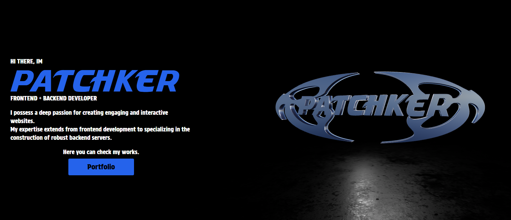
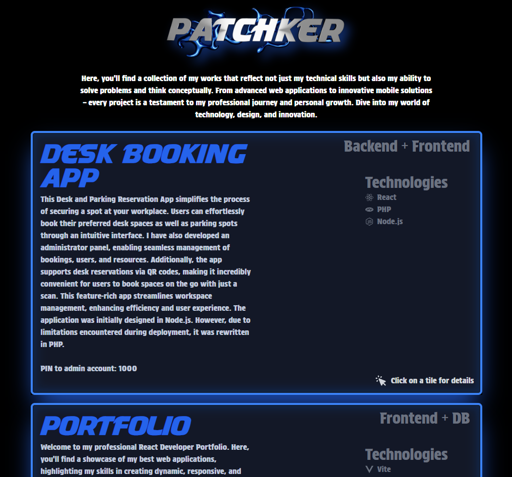

<h1>Portfolio Application Built with React, Vite, Tailwind CSS, and Supabase</h1>

Welcome to my portfolio application, a modern and responsive web project designed to showcase my professional and personal projects. This application is built using a cutting-edge stack that includes React for efficient UI development, Vite for fast builds, Tailwind CSS for intuitive styling, and Supabase as the backend and database. The combination of these technologies provides a seamless, fast, and visually appealing user experience.

<h3>Features</h3>
<b>Interactive UI</b>: Leveraging React, the application offers a dynamic and interactive user experience, with smooth navigation and real-time updates.

<b>Three.js</b>: At the heart of the portfolio's homepage is an immersive 3D model displayed using Three.js, a powerful JavaScript library and API for creating and displaying animated 3D computer graphics in a web browser.

<b>Responsive Design</b>: Tailwind CSS ensures that the portfolio is fully responsive and looks great on all devices, from desktops to mobile phones.

<b>Fast Performance</b>: Vite offers lightning-fast build times and hot module replacement, making the development experience smooth and the application performance optimized.

<b>Real-time Data</b>: With Supabase, an open-source Firebase alternative, the application benefits from real-time database updates, authentication, and instant API generation, facilitating easy management of portfolio projects and user interactions.

<h3>Technologies</h3>
This portfolio application is a demonstration of modern web development practices and tools:

<b>React</b>: A JavaScript library for building user interfaces, enabling the development of a dynamic and single-page application.

<b>Vite</b>: A modern frontend build tool that significantly improves the development experience with fast cold starts and instant hot module replacement.

<b>Tailwind CSS</b>: A utility-first CSS framework for creating custom designs without having to leave your HTML.

<b>Supabase</b>: An open-source Firebase alternative providing all the backend services your application needs, including a database, authentication, instant APIs, and real-time subscriptions.
